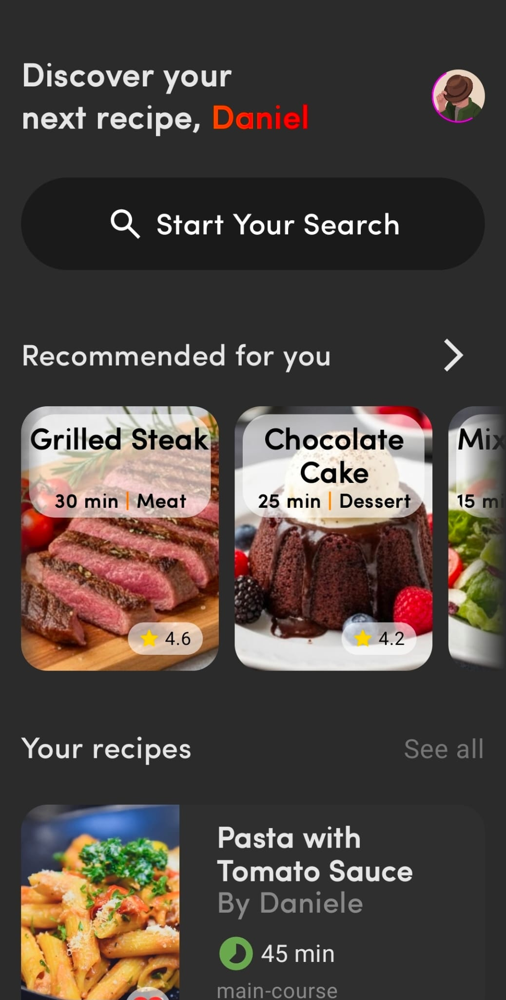
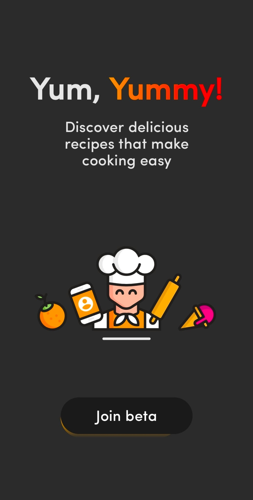
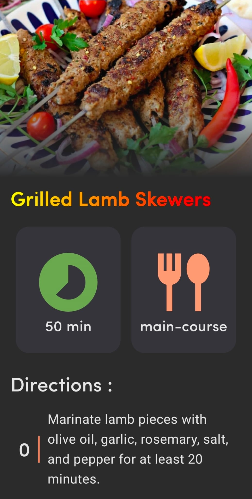

# Yummy - Recipe App (Compose Multiplatform)

Yummy is a **recipe application** built using **Jetpack Compose Multiplatform (CMP)**.  
It showcases recipes with steps, images, and categories. This project is primarily a **demo/prototype**, and **all data inside the app is placeholder data**.

---

## Screenshots

### Dashboard


### Home


### Single Recipe


## Features

- Display a list of recipes with images and categories.
- View detailed recipe steps, including preparation instructions and estimated duration.
- Mark recipes as preferred or favorite.
- Supports basic CRUD operations on recipes (create, read, update, delete) locally.
- Fully built with **Compose Multiplatform** for cross-platform UI.

---

## Placeholder Data

All recipes, steps, images, and other content in the app are **fake/dummy data for demonstration purposes**.  
No real recipes, images, or user data are included.

Examples of placeholder recipes:

- Pasta with Tomato Sauce
- Tomato Soup
- Stuffed Rolls
- Grilled Lamb Skewers
- Baked Potatoes

Each recipe includes **step-by-step instructions**, durations, and optional preview images.

---

## Architecture

- **Kotlin Multiplatform** shared module
- **Jetpack Compose Multiplatform (CMP)** for UI
- **SQLDelight** for local database
- `DbRepo` handles recipe CRUD operations
- Step data stored as `StepEntry` objects for easier manipulation

---

## How to Run

1. Clone the repository:
   ```bash
   git clone https://github.com/daniele-NA/yummy
   cd yummy
